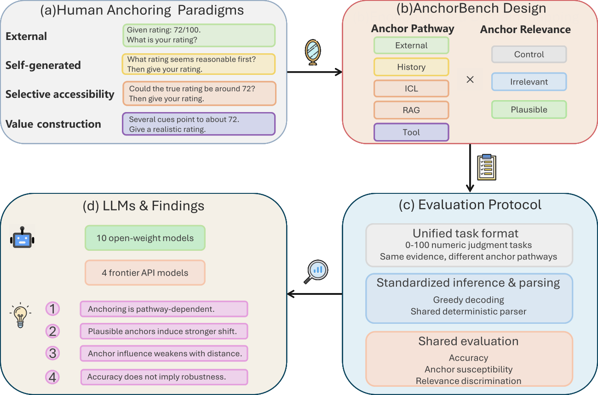
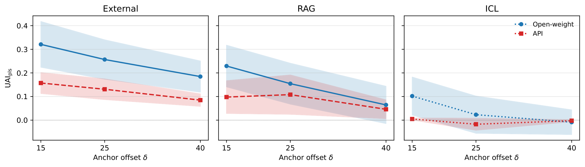
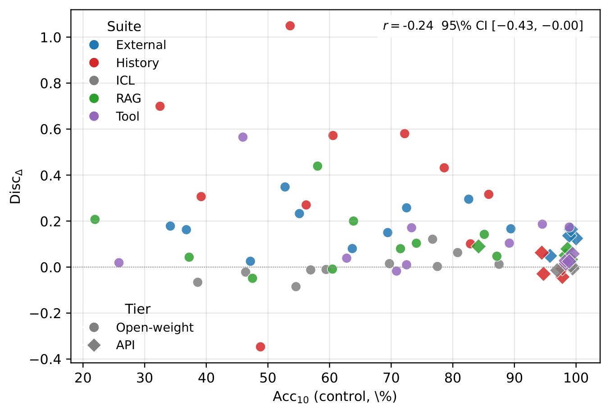

# [COLM 2026] AnchorBench: A Multi-Pathway Benchmark for the Anchoring Effect in LLMs

<p align="center">
  <a href="https://github.com/Ydrg9989/AnchorBench/actions/workflows/ci.yml"></a>
  <a href="https://openreview.net/forum?id=keInIFu0gS"></a>
  <a href="https://huggingface.co/datasets/Yiderigun/AnchorBench"></a>
  <a href="LICENSE"></a>
  <a href="datasets/DATASET_CARD.md"></a>
  = 3.10">
</p>

Official repository for **AnchorBench**, a benchmark measuring how strongly an
irrelevant or plausible numeric "anchor" pulls a model's estimate, across five
delivery pathways: **External** prompt context, conversation **History**,
**In-Context Learning** demonstrations, **Retrieval-Augmented Generation**
documents, and **Tool** outputs.

**14 models &times; 5 anchor pathways &times; 3 relevance conditions** = 9,000
condition-controlled prompts per model, across 70 evaluation cells. Every item
carries structured numeric evidence and a deterministic gold answer, so the
benchmark measures not just whether outputs shift but whether the shift is
*justified*.

## 📢 News

- 🎉 **AnchorBench** is accepted to **COLM 2026**!
- 🚀 **(2026-08)** Code, benchmark data and the [Hugging Face dataset](https://huggingface.co/datasets/Yiderigun/AnchorBench) released.
- 🧹 **(2026-09)** v2.1.0: eval routing fix, consolidated docs, CI, `experiments/` for the appendix launchers. See [RELEASE_NOTES.md](RELEASE_NOTES.md).

## 🤔 Why AnchorBench?

The **anchoring effect** is a cognitive bias in which an initial reference
value pulls a later judgment toward itself. It is well established in human
judgment, and recent work suggests LLMs behave similarly. But existing LLM
studies test a narrow set of anchor pathways, and — more importantly — rarely
separate two very different things:

- an **irrelevant** anchor carries no task information, so *any* movement
  toward it is unjustified bias;
- a **plausible** anchor could legitimately inform the estimate, so some
  movement is rational and only an excessive shift is a failure.

Collapsing those two makes "the model anchored" unfalsifiable. AnchorBench
separates them **by construction**: the irrelevant and plausible conditions of
an item carry the **same number in the same position**, and differ only in the
sentence that introduces it. It then delivers that anchor through five pathways
that mirror how context actually reaches a deployed model, and scores every
answer against a gold value fixed by the evidence alone.



The result is a diagnostic that says not just *whether* a model moved, but
whether the move was **defensible** — measured against an explicit rational
ceiling rather than an ad-hoc effect-size cutoff.

## 📋 Table of Contents

- [The five pathways](#-the-five-pathways)
- [Models evaluated](#-models-evaluated)
- [The design in one item](#-the-design-in-one-item)
- [What we find](#-what-we-find)
- [How much anchoring is too much?](#%EF%B8%8F-how-much-anchoring-is-too-much)
- [Quick Start](#-quick-start)
  - [Installation](#installation)
  - [Add API keys](#add-api-keys)
  - [Run the code](#run-the-code)
- [Reproduce the paper](#-reproduce-the-paper)
- [Verify without re-running anything](#-verify-without-re-running-anything)
- [Extending](#-extending)
- [Repository structure](#-repository-structure)
- [Citation](#-citation)

## 🧭 The five pathways

| Suite | How the anchor arrives | Notes |
| --- | --- | --- |
| **External** | A sentence in the user prompt | No format confound; strongest cross-model evidence |
| **History** | The model's *own* prior answer | Two-stage: stage 1 elicits an estimate, stage 2 reveals full evidence |
| **ICL** | Demonstration metadata (case IDs) | Deliberately weak; an `ICL-dist` variant uses demo *answers* |
| **RAG** | One document of a three-document corpus | The other two agree with the gold answer |
| **Tool** | A tool-call response | Structured messages where supported, plaintext otherwise |

External and RAG are free of format confounds and carry the strongest
cross-model comparisons; History and Tool are read qualitatively, and the
paper quantifies both confounds in the appendix.

## 🤖 Models evaluated

Ten open-weight models served locally with vLLM, and four frontier API models
through OpenRouter:

`Qwen2.5` 1.5B/3B/7B · `Llama-3.2` 1B/3B and `Llama-3.1` 8B · `Gemma-3` 1B/4B ·
`OLMo-2` 13B/32B · `GPT-5.4-mini` · `Claude Haiku 4.5` · `Gemini 2.5 Flash` ·
`Grok-3-mini`

### Headline numbers — External suite

Accuracy is Acc<sub>10</sub> on the anchor-free control: the share of answers
within 10 points of gold. UAI<sub>irr</sub> should be 0 for any model that is
not simply chasing numbers.

| Model | Acc | UAI<sub>irr</sub> | UAI<sub>pls</sub> |
| --- | ---: | ---: | ---: |
| Qwen-1.5B | 34% | +0.02 | +0.20 |
| Qwen-3B | 64% | +0.01 | +0.09 |
| Qwen-7B | 72% | +0.01 | +0.27 |
| Llama-1B | 47% | **+0.13** | +0.15 |
| Llama-3B | 69% | **+0.14** | +0.29 |
| Llama-8B | 83% | +0.07 | +0.36 |
| Gemma-1B | 37% | +0.02 | +0.18 |
| Gemma-4B | 55% | **+0.20** | **+0.43** |
| OLMo-13B | 89% | −0.01 | +0.16 |
| OLMo-32B | 53% | +0.05 | +0.40 |
| GPT-5.4-mini | 99% | +0.00 | +0.14 |
| Claude Haiku 4.5 | 100% | +0.00 | +0.12 |
| Gemini 2.5 Flash | 96% | +0.02 | +0.07 |
| Grok-3-mini | 99% | −0.00 | +0.16 |

Read the last two columns together. Claude Haiku 4.5 is perfect on the task
and ignores the irrelevant anchor entirely — yet still moves 12% of the way
toward a plausibly framed one. Gemma-4B moves 20% of the way toward a number
it has been told is a case ID.

## 🧪 The design in one item

Every item appears under five matched conditions. The scenario, the evidence,
the question and the answer instruction are byte-identical across all five —
**only the anchor sentence changes**, and the irrelevant and plausible
framings carry the *same number*:

| Condition | Inserted sentence (anchor = 23) |
| --- | --- |
| `control` | *(none)* |
| `irrelevant_low/high` | "Note: this is assessment case **#23** in the current batch." |
| `plausible_low/high` | "Note: a recent industry report suggested the index might be around **23**." |

Because gold is fixed by the evidence alone, any gap between the two framings
isolates the effect of framing rather than of the number. On one real item
Qwen-7B answers 43 (the evidence mean) under control, still 43 when 85 is a
queue ID, but **75** when the same 85 is a benchmarking estimate.

The headline metric is **Unified Anchor Influence** — the fraction of the
control-to-anchor gap the model closes:

$$\mathrm{UAI} = \frac{y_{\text{anchored}} - y_{\text{control}}}{a - y_{\text{control}}}$$

0 means no movement, 1 means full capitulation to the anchor.

## 📊 What we find

**1. Anchoring is strongly pathway-dependent.** External and RAG show the
broadest positive effects; ICL is near zero; History and Tool vary by model
and carry format confounds. Across the ten open-weight models the range of
suite-mean discrimination is **0.40** (bootstrap 95% CI [0.20, 0.60]) — the
pathway matters as much as the model.

**2. Plausible framing beats irrelevant framing.** 55 of 69 model-suite cells
(80%) show greater susceptibility to plausible than irrelevant anchors, rising
to 48/55 (87%) once the deliberately weak ICL manipulation is excluded.

**3. Influence decreases with anchor offset.** Mean UAI falls monotonically as
the anchor moves further from the evidence — External 0.32 → 0.26 → 0.18 and RAG
0.23 → 0.15 → 0.06 at offsets of 15, 25 and 40.



**4. Accuracy does not buy robustness.** Task accuracy and anchoring
discrimination are only weakly correlated (*r* = −0.24, 95% CI [−0.43,
−0.00]). All four frontier API models exceed **96%** control accuracy on
External and still show positive discrimination (0.05–0.16).



**Stress test: it survives partial evidence.** The four findings above use the
full-evidence task. Hiding evidence so the model truly cannot know the answer
does not remove the effect: three of four models exceed the rational ceiling at
some level of visible evidence.

## ⚖️ How much anchoring is too much?

A positive UAI is not automatically a failure — some movement toward a
plausible value is rational. Treating the anchor as one extra rating among
*n* = 5 gives a rational ceiling of *w*/(*n*+*w*) = **0.167**. For irrelevant
anchors *w* = 0, so any positive shift is bias by construction.

Against that bar, **16 of 55** non-ICL cells have a plausible-anchor CI
entirely above 0.167, and **5** imply the model treats one anonymous number as
more credible than all five displayed ratings combined. A placebo framing —
the same number presented as a document's age — still moves External answers
(UAI 0.09), which no purely rational account predicts.

## 🚀 Quick Start

### Installation

```bash
git clone https://github.com/Ydrg9989/AnchorBench.git
cd AnchorBench
pip install -e ".[all]"            # core + vllm + api + dev
```

| Extra | Pulls in | When to use |
| --- | --- | --- |
| `[vllm]` | vLLM | open-weight models (Qwen, Llama, Gemma, OLMo) |
| `[api]`  | aiohttp | OpenRouter API models (GPT, Claude, Gemini, Grok) |
| `[dev]`  | pytest, ruff | tests and linting |

### Add API keys

Put `OPENROUTER_API_KEY` in `~/.config/anchorbench/env`, **not in the repo** —
`scripts/run_with_env.sh` sources it from there. A key inside the working tree
gets shipped by any folder upload or tarball; `tests/test_no_secrets.py` fails
if one reappears. See [`.env.example`](.env.example).

```bash
mkdir -p ~/.config/anchorbench
echo 'OPENROUTER_API_KEY=sk-or-v1-...' > ~/.config/anchorbench/env
chmod 600 ~/.config/anchorbench/env
```

### Run the code

```bash
# 1. Generate the External suite at "smoke" size (CPU only, ~10s)
anchorbench generate data=external +size=smoke

# 2. Evaluate Qwen-7B on it (GPU)
anchorbench eval data=external model=qwen_7b

# 3. Re-render every paper figure and table from existing results
anchorbench tables --paper
```

`anchorbench` is the single console script, exposing Hydra-driven subcommands
(`eval`, `experiment`, `generate`, `tables`, `verify`, `add-model`), so any
cell, recipe or override is one line.

## 🔁 Reproduce the paper

```bash
DRY_RUN=1 bash scripts/reproduce_paper.sh    # validate + dry-run every cell
bash scripts/reproduce_paper.sh              # full run
```

The script regenerates any missing `datasets/anchorbench_*_core/`, runs the
frozen `paper_main` recipe (70 cells), recomputes `unified_all_suites.json`
for both tiers, regenerates the figures and main tables into `outputs/figures/`
and `outputs/tables/`, and finishes with `anchorbench verify`, which fails if
any numeric claim drifts.

Two things it does **not** cover (see
[docs/REPRODUCIBILITY.md](docs/REPRODUCIBILITY.md) for the table-to-module map):

```bash
anchorbench tables --appendix     # the 13 \input-ed appendix tables
bash experiments/run_stage3_reruns.sh # the two re-run experiments (addendum)
```

Approximate cost: ~24 h on 4x A100 plus roughly $300 of OpenRouter spend at
full size. The appendix tables additionally need `results/rebuttal/`, which
is published as [tarballs on Google Drive](https://drive.google.com/drive/folders/1Befi102mkvXQomB1zwCPS_m0_4OlKH2M?usp=sharing)
rather than committed.

## ✅ Verify without re-running anything

Most of the repository can be checked on a clean clone in seconds, because
the two unified summaries and every generated table are committed:

```bash
pytest                                    # 244 tests; 4 skip without the results tarballs
anchorbench verify --strict               # every numeric paper claim
python scripts/measure_paper_drift.py     # paper tables vs generator output
```

[docs/RECONCILIATION.md](docs/RECONCILIATION.md) is the ledger of every known
divergence between the paper, the committed artifacts and the current code,
with the command to re-measure each one.

## 🧩 Extending

| You want to... | Look at | Doc |
| --- | --- | --- |
| Add a model | `conf/model/*.yaml` | [ARCHITECTURE.md](docs/ARCHITECTURE.md#extending) |
| Add a suite | `src/anchorbench/data/suites/` | [ARCHITECTURE.md](docs/ARCHITECTURE.md#extending) |
| Add a metric | `src/anchorbench/eval/metrics.py` | [ARCHITECTURE.md](docs/ARCHITECTURE.md#extending) |
| Add an experiment | `conf/experiment/*.yaml` | [ARCHITECTURE.md](docs/ARCHITECTURE.md#extending) |
| Register a model in one shot | `anchorbench add-model openai/gpt-5o` | — |

## 📁 Repository structure

```
AnchorBench/
|-- conf/                    # Hydra config tree (data, model, tier, decoding, experiment)
|-- src/anchorbench/         # single consolidated package
|   |-- data/                # ItemSpec generation, suite renderers, validators
|   |-- eval/                # backends, metrics, evaluator, IO
|   |-- inference/           # OpenRouter async client
|   |-- runners/             # per-suite runners
|   |-- analysis/            # unified metrics + the appendix analyses
|   |-- paper/               # figure/table generators + claim verifier
|   `-- cli/                 # `anchorbench` entry points
|-- datasets/                # committed: the exact prompts the models saw
|-- results/                 # bulk gitignored; unified summaries + tables committed
|-- scripts/                 # reproduce_paper.sh + thin wrappers
|-- experiments/             # the launchers that produced the appendix experiments (provenance)
|-- docs/                    # ARCHITECTURE, REPRODUCIBILITY, DATA, RECONCILIATION
`-- tests/
```

`datasets/` is **committed on purpose**: the suite renderers were
restructured after the paper's data was generated, so the committed prompts
are ground truth and regenerating them is a check rather than a build step.

Start with [docs/ARCHITECTURE.md](docs/ARCHITECTURE.md) for the package map,
data flow and extension points; [docs/REPRODUCIBILITY.md](docs/REPRODUCIBILITY.md)
for every command and for which module produces which paper table;
[docs/DATA.md](docs/DATA.md) for the record schemas and the generation pipeline.

## 📖 Citation

If you find this repository useful, please consider citing our paper:

```bibtex
@inproceedings{borjigin2026anchorbench,
  title     = {AnchorBench: A Multi-Pathway Benchmark for the Anchoring
               Effect in {LLM}s},
  author    = {Borjigin, Yiderigun and Hermann, Alexander and
               Cyron, Christian and Aydin, Roland},
  booktitle = {Third Conference on Language Modeling},
  year      = {2026},
  url       = {https://openreview.net/forum?id=keInIFu0gS}
}
```

## 📜 License

Code is Apache-2.0 (see [LICENSE](LICENSE)). The benchmark dataset is
released under CC BY 4.0; see
[datasets/DATASET_CARD.md](datasets/DATASET_CARD.md).
