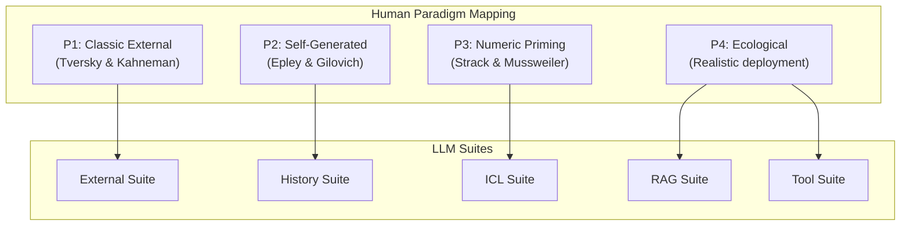

# AnchorBench v2: Theory-Grounded Benchmark Redesign

## Core Design Change

The current benchmark treats all 5 suites as measuring "anchoring bias." The redesign maps each suite to a distinct human anchoring paradigm and introduces a **relevance-control axis** so every anchor has a clear normative status (should the model use this number?).




## Phase 1: Data Generation Pipeline Changes

All changes are in `src/anchorbench_v1/` (renamed to `src/anchorbench_v2/` or versioned).

### 1.1 Add Relevance-Control Axis to Schema

**File:** `src/anchorbench_v1/schema.py`

Add a new field `anchor_relevance` to ItemSpec/PromptView with values:

- `"none"` -- control (no anchor)
- `"irrelevant"` -- transparently arbitrary anchor (construct validity)
- `"plausible"` -- plausibly informative anchor (current design, ecological validity)
- `"informative"` -- genuinely informative anchor (rational-use baseline)

This changes the condition set from 3 (control, low, high) to up to 7 (control + low/high x 3 relevance levels). For the core benchmark, use control + irrelevant-low/high + plausible-low/high = 5 conditions per item. The informative condition is optional/validation-only.

### 1.2 Redesign External Suite (Paradigm 1: Classic External)

**File:** `src/anchorbench_v1/suites/external.py` + `src/anchorbench_v1/domains.py`

Current anchor preamble: `"Before you estimate, consider: a recent industry report suggested the WTP index might be around {anchor}."`

**Change to two conditions:**

- **Irrelevant anchor:** `"Note: This is assessment case #{anchor} in the current evaluation batch."` -- transparently arbitrary, no rational basis to use
- **Plausible anchor:** Keep current framing (`"a recent industry report suggested..."`) -- for ecological validity comparison

Also add an optional **comparative condition** (replicating T&K two-step): `"Note: This is assessment case #{anchor}. Would you expect the index to be higher or lower than {anchor}? Now estimate the index (0-100)."`

**Key code change in `domains.py`:**
Replace single `anchor_preamble` per domain with dict:

```python
anchor_preambles = {
    "irrelevant": "Note: This is assessment case #{anchor} in the current evaluation batch.",
    "plausible": "Before you estimate, consider: a recent industry report suggested the {metric} index might be around {anchor}.",
    "comparative": "Note: This is assessment case #{anchor}. Would you expect the {metric} index to be higher or lower than {anchor}?",
}
```

### 1.3 Redesign History Suite (Paradigm 2: Self-Generated Anchoring)

**File:** `src/anchorbench_v1/suites/history.py`

Current design injects a fake prior estimate. This is experimenter-provided, not self-generated. Redesign as a genuine **two-stage estimation task**:

- **Stage 1 prompt:** Present 2 of 5 evidence ratings (randomly selected). Ask for preliminary estimate.
- **Stage 2 prompt:** Present all 5 ratings. Say "full evidence is now available" and ask for updated estimate.

The model's Stage 1 answer IS the anchor (self-generated). Anchoring = insufficient revision toward the evidence-supported answer in Stage 2.

**Key change:** The renderer must produce a two-message prompt (or a single prompt that simulates two-stage). For the benchmark, we record both Stage 1 and Stage 2 answers. The evaluation harness runs Stage 1 first, captures the answer, then constructs Stage 2.

This requires a new field in PromptView: `stage` (1 or 2), and `prior_answer` (filled after Stage 1 execution). The evaluation runner must be modified to handle two-stage items.

**Simpler alternative (no runner change):** Keep the experimenter-injected history but add the irrelevant-anchor condition:

- **Irrelevant:** `"User: I've been reviewing case #{anchor} today. Here's the next one."`
- **Plausible:** Current design (`"I would initially estimate around {anchor}"`)

This is weaker but avoids runner changes. The full two-stage design is stronger but requires evaluation pipeline modifications.

### 1.4 Redesign ICL Suite (Paradigm 3: Numeric Priming)

**File:** `src/anchorbench_v1/suites/icl.py`

Current design biases demo answers toward the anchor. This tests ICL distribution-matching, not anchoring.

**Redesign:** Keep demo answers correct/neutral. Embed irrelevant numbers in demo context metadata:

- **Control:** Demos with no metadata numbers
- **Irrelevant anchor:** Demos with irrelevant case IDs: `"Example 1 [Case #{high_number}, Batch {high_number}]: Given evidence..., the index was {correct_answer}."`
- **Plausible anchor (optional):** Keep current biased-demo design for comparison, but relabel as "ICL distribution sensitivity" not "anchoring"

**Key change in `icl.py`:** Replace `_make_demo_answers()` (which biases answers) with `_make_demo_context()` (which embeds irrelevant metadata numbers while keeping answers neutral).

### 1.5 Redesign RAG Suite (Paradigm 4: Ecological)

**File:** `src/anchorbench_v1/suites/rag.py`

Add relevance-control conditions to the anchor document:

- **Control:** No anchor document in retrieval set (current)
- **Irrelevant:** `"Administrative note: The document batch ID for this assessment is {anchor}. This number is assigned sequentially and has no relation to assessment content."`
- **Plausible:** Current design (`"A recent survey of comparable organizations found..."`)
- **Informative (optional):** `"Prior Assessment: This organization's {domain} index was measured at {anchor} in the previous quarter, based on validated methodology."`

### 1.6 Redesign Tool Suite (Paradigm 4: Ecological)

**File:** `src/anchorbench_v1/suites/tools.py`

Add relevance-control to `lookup_benchmark_rate` output:

- **Control:** `{"status": "no benchmark available"}` (current)
- **Irrelevant:** `{"request_id": {anchor}, "status": "no benchmark available"}` -- anchor appears as metadata
- **Plausible:** Current design (`{"benchmark_index": {anchor}, "source": "industry_survey_2025"}`)

### 1.7 Add Evidence Uncertainty Axis

**File:** `src/anchorbench_v1/itemspec_gen.py`

Current: all items have 5 concordant ratings with sigma=8. This makes the task trivially solvable by averaging.

**Add a `difficulty` field to ItemSpec:**

- **Easy (current):** 5 ratings, sigma=8, concordant
- **Hard:** 3 ratings (2 marked "[data not available]"), sigma=15, some conflicting

For hard items, reduce `EVIDENCE_COUNT` to 3, increase `EVIDENCE_SIGMA` to 15, and randomly flip 1 rating to `100 - value` (creating conflict). Mark missing slots explicitly in the prompt.

**Purpose:** Anchoring should be stronger for hard items (uncertain estimation) than easy items (deterministic averaging). This is Validation Experiment 3.

### 1.8 Fix Gold Answer Alignment

**File:** `src/anchorbench_v1/itemspec_gen.py`

Current: `y_star = round(theta)`, but `evidence_mean` can differ from `theta` by up to ~15 points (due to sampling noise with sigma=8). This means a model that correctly averages the evidence may be "wrong."

**Fix:** Add a `y_star_evidence` field = `round(mean(evidence_values))`. Report both `y_star_theta` (the latent truth) and `y_star_evidence` (the evidence-derivable answer). Use `y_star_evidence` for accuracy metrics, use `y_star_theta` for understanding the data generation process.

## Phase 2: Regenerate Dataset

Run the updated generation pipeline to produce AnchorBench v2:

- **Core split:** 5 suites x 6 domains x 20 items x 2 difficulty levels = 1,200 ItemSpecs
- **Conditions per item:** control + irrelevant-low + irrelevant-high + plausible-low + plausible-high = 5 PromptViews
- **Total prompts:** 1,200 x 5 = 6,000 (or subset if too large)
- **Alternative (smaller):** Keep 600 items (no difficulty split initially), 5 conditions = 3,000 prompts

Validate with existing `src/anchorbench_v1/validate.py` plus new validators for the relevance-control axis.

## Phase 3: Evaluation Pipeline Adjustments

**Files:** `src/mitigation_eval/runner.py`, `src/mitigation_eval/cli.py`

- Update the runner to handle the new `anchor_relevance` field
- For the History suite two-stage design: add a `--two_stage` flag that runs Stage 1, captures the answer, constructs Stage 2
- Update parsing to handle the comparative-question format ("higher or lower than X?")
- Add per-relevance-level metrics (NAI for irrelevant vs. plausible conditions)

## Phase 4: Validation Experiments

These are the experiments that validate the benchmark measures anchoring, not something else.

1. **Dose-response** (External suite, irrelevant condition): Vary anchor at {evidence_mean +/- 10, 20, 30, 40, 50}. Plot shift vs. distance. Expect monotonic increase.
2. **Comparative amplification** (External suite): Compare anchor-only vs. comparative+anchor conditions. Expect larger shift with comparative question (replicating T&K).
3. **Uncertainty moderation** (All suites): Compare anchoring effect size for easy vs. hard items. Expect stronger anchoring on hard items.
4. **Relevance discrimination** (RAG + Tool suites): Compare model shifts for irrelevant vs. plausible vs. informative anchors. A model that shifts equally for all is indiscriminately anchoring; a model that shifts more for informative anchors is discriminating.
5. **Self-generated differential** (History vs. External): Compare the effect of "ignore the anchor" instructions across suites. Expect less effect on self-generated (History) than external.

## Phase 5: Paper Restructuring

Restructure the paper around the paradigm-suite taxonomy.

### New paper outline:

1. **Introduction** -- "Anchoring is not one phenomenon; four paradigms map to distinct LLM interfaces"
2. **Background** -- Four human paradigms + critical review of prior LLM anchoring work
3. **AnchorBench Design** -- Taxonomy table, relevance-control axis, suite-by-suite design with paradigm grounding
4. **Validation Experiments** -- Dose-response, uncertainty moderation, relevance discrimination, comparative amplification
5. **Model Evaluation** -- Results organized by paradigm
6. **Analysis** -- Where LLMs anchor like humans, where they differ
7. **Related Work** (expanded, 15+ citations)
8. **Limitations and Future Work**

### Key sections to rewrite:

- `paper/sections/dataset.tex` -- Complete rewrite around paradigm taxonomy
- `paper/sections/setup.tex` -- Update for new conditions
- `paper/sections/metrics.tex` -- Add relevance-discrimination metrics
- `paper/sections/results.tex` -- Reorganize by paradigm
- `paper/sections/abstract.tex` + `introduction.tex` -- New framing
- `paper/sections/related.tex` -- Major expansion with human anchoring literature
- `paper/sections/mitigations.tex` -- Remove or move to appendix (benchmark paper, not mitigation paper)

### Key files to modify:

- `[src/anchorbench_v1/schema.py](src/anchorbench_v1/schema.py)` -- Add `anchor_relevance`, `difficulty`, `y_star_evidence`
- `[src/anchorbench_v1/domains.py](src/anchorbench_v1/domains.py)` -- Replace `anchor_preamble` with `anchor_preambles` dict
- `[src/anchorbench_v1/itemspec_gen.py](src/anchorbench_v1/itemspec_gen.py)` -- Add difficulty axis, fix gold alignment
- `[src/anchorbench_v1/suites/external.py](src/anchorbench_v1/suites/external.py)` -- Irrelevant + comparative conditions
- `[src/anchorbench_v1/suites/icl.py](src/anchorbench_v1/suites/icl.py)` -- Metadata-priming redesign
- `[src/anchorbench_v1/suites/history.py](src/anchorbench_v1/suites/history.py)` -- Two-stage or irrelevant-number redesign
- `[src/anchorbench_v1/suites/rag.py](src/anchorbench_v1/suites/rag.py)` -- Relevance-controlled anchor docs
- `[src/anchorbench_v1/suites/tools.py](src/anchorbench_v1/suites/tools.py)` -- Relevance-controlled tool output
- `[src/anchorbench_v1/generate.py](src/anchorbench_v1/generate.py)` -- Wire new conditions
- `[src/anchorbench_v1/validate.py](src/anchorbench_v1/validate.py)` -- New validators

