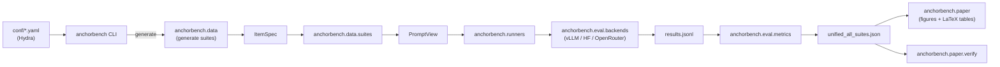

# AnchorBench Architecture

This document describes the consolidated package layout introduced in
v2.0 and the data flow from a Hydra config to a paper artifact.

## Package map

```
src/anchorbench/
|-- __init__.py            # version, public API
|-- data/                  # was anchorbench_v1
|   |-- domains.py             # 6 anchored estimation domains
|   |-- itemspec_gen.py        # ItemSpec construction (offset grid)
|   |-- generate.py            # end-to-end suite generation
|   |-- schema.py              # ItemSpec / PromptView dataclasses
|   |-- llm_enhance.py         # optional LLM-augmented scenario text
|   |-- openrouter_client.py   # data-side OpenRouter wrapper
|   |-- validate.py            # CLI: anchorbench.data.validate
|   |-- validators.py          # deterministic dataset checks
|   `-- suites/                # ItemSpec -> PromptView renderers
|       |-- _shared.py
|       |-- external.py, history.py, icl.py, icl_dist.py, rag.py, tool.py
|-- eval/                  # was anchorbench_eval
|   |-- backends.py            # HFBackend, VLLMBackend
|   |-- parsing.py             # numeric extractor + LLM fallback
|   |-- evaluator.py           # per-record evaluation loop
|   |-- io.py                  # JSONL + manifest helpers
|   |-- metrics.py             # TAR, UAI, Disc_delta, MAE, Acc10, BH, Wilcoxon
|   |-- constants.py           # MODEL_SHORT, SUITES, defaults
|   `-- runner_utils.py        # argparse + backend factory
|-- inference/             # was mitigation_eval
|   `-- async_api.py           # AsyncOpenRouterClient
|-- runners/               # was scripts/eval/run_*.py
|   |-- base.py                # re-exports eval.runner_utils helpers
|   |-- external.py, history.py, icl.py, rag.py, tool.py
|   |-- api.py                 # OpenRouter API benchmark
|   |-- icl_dist_api.py
|   |-- sampling.py            # sampling robustness sweep
|   `-- mitigation_baseline.py, mitigation_headroom.py
|-- analysis/              # was scripts/eval/recompute_*.py etc
|   |-- unified.py             # rebuilds unified_all_suites.json
|   |-- gold_shift.py
|   |-- sampling.py
|   `-- mitigation.py
|-- paper/                 # was scripts/eval/paper/ + scripts/verify_paper_tables.py
|   |-- _common.py             # shared figure/table helpers
|   |-- fig4_dose_response.py
|   |-- fig5_acc_vs_disc.py
|   |-- tables_main.py         # Table 1, Table 2
|   |-- tables_appendix.py     # Tables 4-16, model details, boundary subtable
|   `-- verify.py              # data-driven claim verifier
`-- cli/                   # Hydra-driven entry points
    |-- main.py                # console script: `anchorbench`
    |-- eval.py, experiment.py, generate.py, tables.py, add_model.py
```

Three deprecation shims (`anchorbench_v1`, `anchorbench_eval`,
`mitigation_eval`) re-export the new submodules and emit
`DeprecationWarning`. They are scheduled for removal in v2.1.

## Hydra config tree

```
conf/
|-- config.yaml               # default composition: data + model + decoding
|-- data/
|   |-- external.yaml, history.yaml, icl.yaml, icl_dist.yaml, rag.yaml, tool.yaml
|-- model/
|   |-- qwen_{1_5b,3b,7b}.yaml
|   |-- llama_{1b,3b,8b}.yaml
|   |-- gemma_{1b,4b}.yaml
|   |-- olmo_{13b,32b}.yaml
|   `-- gpt_5_mini.yaml, claude_haiku_4_5.yaml, gemini_2_5_flash.yaml, grok_3_mini.yaml
|-- tier/
|   `-- small_a.yaml, small_b.yaml, medium.yaml, large.yaml, xlarge.yaml, api.yaml
|-- decoding/
|   |-- greedy.yaml, sample_t07.yaml
`-- experiment/
    |-- paper_main.yaml          # 14 models x 5 suites (frozen recipe)
    |-- paper_icl_dist.yaml      # Table 14
    |-- paper_history_matched.yaml  # Table 13
    |-- paper_sampling.yaml      # Sec C.4
    |-- paper_mitigation_headroom.yaml
    |-- paper_gold_shift.yaml    # Table 11
    `-- paper_run.yaml           # frozen reproduction pin
```

Override anything from the command line:

```bash
anchorbench eval data=icl model=qwen_7b model.batch_size=128 +decoding.n_samples=5
```

## Data flow



## Key invariants

- **Datasets are byte-identical** across re-runs of `anchorbench
  generate` for a fixed seed. The validator enforces this.
- **`unified_all_suites.json` is byte-identical** when recomputed from
  the same `results/.../*.jsonl` records. The verifier enforces this.
- **One model = one config file.** Models are referenced by their
  config name (e.g. `qwen_7b`), not by HF Hub ID, so swapping
  checkpoints is one YAML edit.
- **`anchorbench verify` is the source of truth.** Every numeric claim
  in the paper has a typed `Claim(suite, metric, value, tolerance)` in
  `src/anchorbench/paper/verify.py`. CI fails if any claim drifts.

## Where to start reading

- New to the codebase &rarr; `docs/REPRODUCIBILITY.md`.
- Adding a model or suite &rarr; `docs/EXTENDING.md`.
- Understanding metrics &rarr; `src/anchorbench/eval/metrics.py` (each
  function has a paper section reference in its docstring).
