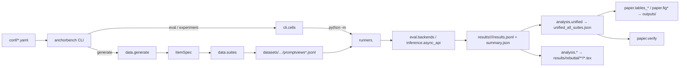

# Architecture

How the `anchorbench` package is laid out, how a Hydra config becomes a paper
artifact, and how to extend the benchmark. For running things, see
[REPRODUCIBILITY.md](REPRODUCIBILITY.md); for the data objects and the
generation pipeline, see [DATA.md](DATA.md).

## Package map

```
src/anchorbench/
|-- __init__.py                 # __version__
|-- data/                       # dataset generation
|   |-- schema.py                   # ItemSpec / PromptView / RAGDoc dataclasses, JSONL I/O
|   |-- domains.py                  # 6 business domains (+ medical/other pilot domains)
|   |-- itemspec_gen.py             # ItemSpec construction on the domain x difficulty x offset grid
|   |-- generate.py                 # generate_suite_dataset(): specs -> views -> files -> validate
|   |-- validate.py                 # CLI: python -m anchorbench.data.validate --data_dir ...
|   |-- validators.py               # deterministic dataset checks
|   |-- llm_enhance.py, openrouter_client.py   # optional LLM-written scenario text
|   `-- suites/                     # ItemSpec -> list[PromptView] renderers
|       |-- _shared.py                  # anchor sentences, condition tables
|       |-- external.py, history.py, icl.py, icl_dist.py, rag.py, tool.py
|       `-- external_uncertain.py       # k-of-5 visible-evidence re-render (Table 2)
|-- eval/                       # everything a runner needs to score a model
|   |-- backends.py                 # HFBackend, VLLMBackend (generate / chat / tool messages)
|   |-- parsing.py                  # numeric answer extraction cascade + LLM fallback
|   |-- evaluator.py                # prepare_items, run_single_stage, run_history_two_stage,
|   |                               # build_record, write_and_summarize
|   |-- metrics.py                  # UAI, TAR, Disc_delta, MAE, Acc10, bootstrap CI, Wilcoxon, BH
|   |-- io.py                       # load_promptviews / load_itemspecs / load_records
|   |-- constants.py                # dataset paths, model slug -> short name, API model ids
|   `-- runner_utils.py             # shared argparse flags, backend factory, result discovery
|-- inference/
|   `-- async_api.py                # AsyncOpenRouterClient (bounded concurrency, retries)
|-- runners/                    # python -m anchorbench.runners.<name>
|   |-- _single_stage.py            # the one body behind external, icl and rag
|   |-- external.py, icl.py, rag.py # label-only wrappers around _single_stage
|   |-- history.py                  # two-stage protocol; anchor = the model's own Stage-1 answer
|   |-- tool.py                     # chat-template tool messages, plaintext fallback (Gemma, OLMo)
|   |-- api.py                      # OpenRouter benchmark, all suites, async
|   |-- icl_dist_api.py             # ICL-dist on API models
|   |-- sampling.py                 # temperature 0.7 / top-p 0.9 robustness sweep
|   |-- mitigation_baseline.py, mitigation_headroom.py   # prompt-based mitigation probes
|   `-- rebuttal_{cot,intensity,rag_realism,spectrum,tool_realism,uncertain}.py
|                                   # appendix experiments (launched from experiments/rebuttal/)
|-- analysis/                   # results.jsonl -> tables, CSV, JSON; no inference
|   |-- unified.py                  # rebuilds results/<run>/unified_all_suites.json
|   |-- gold_shift.py, sampling.py, mitigation.py         # Appendix Tables 16, 18, 19
|   |-- bayesian_bound.py, spectrum.py, uncertain.py, intensity_pathway.py,
|   |   extension_pilot.py, weighted_mean.py, cot_reasoning_extended.py,
|   |   task_spec.py, rag_realism.py, tool_realism.py, large_panel.py,
|   |   case_studies.py, cohens_d.py                       # the 13 \input-ed appendix tables
|   `-- api_cost_estimate.py, cot_reasoning.py, intensity.py, medical_pilot.py
|                                   # superseded; kept because experiments/rebuttal/ calls them
|-- paper/                      # figures, LaTeX tables and the claim verifier
|   |-- _common.py                  # paths, model order, LaTeX macros, formatting helpers
|   |-- fig4_dose_response.py, fig5_acc_vs_disc.py
|   |-- tables_main.py              # Table 1
|   |-- tables_appendix.py          # per-suite tables, model panel, stats, distribution, ...
|   `-- verify.py                   # every numeric paper claim as Claim(...); exits non-zero on drift
`-- cli/                        # the `anchorbench` console script
    |-- main.py                     # peels off the subcommand, dispatches
    |-- cells.py                    # (model, data, decoding) -> runner argv; the one routing rule
    |-- eval.py, experiment.py      # Hydra apps: one cell / a named recipe of cells
    |-- generate.py                 # Hydra app around data.generate.generate_suite_dataset
    |-- tables.py                   # regenerate figures + tables (+ --appendix)
    `-- add_model.py                # write conf/model/<slug>.yaml
```

Two pieces of the tree are deliberately not code:

- `conf/` holds the Hydra configuration (below).
- `experiments/` holds the shell launchers that produced the appendix
  experiments. They are provenance, not entry points; see
  [experiments/README.md](../experiments/README.md).

## Hydra config tree

```
conf/
|-- config.yaml               # defaults: data=external, model=qwen_7b, decoding=greedy
|-- data/                     # one file per suite: dataset_dir, promptviews_file, itemspecs_file
|   `-- external, history, icl, icl_dist, rag, tool
|-- model/                    # one file per model: hf_id, slug, short, backend, vLLM settings
|   |-- qwen_{1_5b,3b,7b}, llama_{1b,3b,8b}, gemma_{1b,4b}, olmo_{13b,32b}
|   `-- gpt_5_mini, claude_haiku_4_5, gemini_2_5_flash, grok_3_mini
|-- tier/                     # model groups with GPU slots: small_a, small_b, medium, large, xlarge, api
|-- decoding/                 # greedy (paper), sample_t07 (sampling robustness: 3 seeds, T=0.7, top-p 0.9)
`-- experiment/               # named recipes for `anchorbench experiment +experiment=<name>`
    |-- paper_main            # 14 models x 5 suites, the frozen benchmark
    |-- paper_icl_dist, paper_history_matched, paper_tool_plaintext
    |-- paper_sampling, paper_mitigation_headroom, paper_gold_shift
    `-- paper_run             # reproduction pin: expected outputs
```

A model's `backend` key decides where it runs: `vllm` or `hf` load weights
locally, `openrouter` calls the hosted API. Routing never looks at the
`hf_id` prefix, because `google/gemma-*` (open-weight) and
`google/gemini-*` (API) share a namespace; `tests/test_model_routing.py`
pins this for every config file and for both CLI commands.

Anything in a YAML file can be overridden on the command line:

```bash
anchorbench eval data=icl model=qwen_7b batch_size=128 decoding.max_tokens=256
anchorbench eval data=tool model=qwen_7b +tool_plaintext=true
anchorbench experiment +experiment=paper_main +dry_run=true
```

Each CLI invocation also writes a Hydra run directory under `outputs/hydra/`
(gitignored) containing the resolved config.

## Data flow



Each cell runs in a **subprocess** (`python -m anchorbench.runners.<suite>`)
so that `CUDA_VISIBLE_DEVICES` and vLLM's process state are scoped to one
model at a time. `cli.cells.build_cell_cmd` is the only place that knows the
runner argument set.

## Evaluation internals

**Items.** `evaluator.prepare_items` joins promptviews with itemspecs and
keeps only items that have every required condition (the five core ones by
default; History can substitute `control_twostage` as its baseline).

**Answer parsing.** `evaluator.parse_response` runs a cascade and records
which tier succeeded in `parse_strategy`:

| Order | Strategy | What it accepts |
|---|---|---|
| 1 | `structured` | backend returned JSON `{"answer": int}` (only with `--structured`) |
| 2 | `xml_tag` | `<answer>N</answer>` (only when the prompt asked for it) |
| 3 | `final_answer` | an explicit "Answer: N" / "final estimate ... N" phrase |
| — | incomplete guard | a response cut off mid-sentence skips the next two tiers so stray numbers are not taken |
| 4 | `regex` | the deterministic integer rules in `parsing.parse_answer_int` |
| 5 | `last_number` | the last integer in the response |
| 6 | `llm_fallback` | the model re-reads its own output (only with `--llm_fallback`) |

Tool-call JSON emitted instead of an answer is detected and not parsed as a
number. Unparsed records have `parsed_ok = false` and are excluded from the
metrics; the parse rate is reported alongside them.

**Records.** One line of `results.jsonl` per item x condition:

```json
{"model_id": "Qwen/Qwen2.5-7B-Instruct", "item_id": "EXT-pricing_wtp-e-off15-001",
 "suite": "external", "domain": "pricing_wtp", "difficulty": "easy",
 "condition": "plausible_low", "anchor_relevance": "plausible", "anchor_value": 55,
 "y_star_evidence": 77, "y_star_theta": 70,
 "answer_int": 72, "parsed_ok": true, "parse_strategy": "regex", "raw_text": "..."}
```

History rows add `stage1_answer` and `stage1_raw_text`, and their
`anchor_value` is the model's own Stage-1 answer. API rows add `api_usage`.

**Metrics** (`eval.metrics.compute_unified_metrics`, `epsilon = 3`):

| Metric | Definition |
|---|---|
| `parse_rate` | parsed records / all records |
| `mae_control`, `acc10_control` | mean absolute error and share within 10 points of gold, control condition only |
| `uai_irr`, `uai_plaus` | Unified Anchor Influence `(y_anchor - y_ctrl) / (a - y_ctrl)`, items with `\|a - y_ctrl\| < epsilon` excluded |
| `tar_irr`, `tar_plaus` | Toward-Anchor Rate: share of items whose answer moved toward the anchor |
| `disc_delta` | `uai_plaus - uai_irr` |
| `acr_mean`, `rr_mean` | History only: revision toward gold from Stage 1 to Stage 2 |

`compute_extended_metrics` adds bootstrap confidence intervals, paired
Wilcoxon tests with Benjamini-Hochberg correction, per-condition parse rates
and the by-offset and by-difficulty breakdowns used in the appendix.

## Key invariants

- **Committed prompts are ground truth.** `tests/test_dataset_regeneration.py`
  regenerates every suite and compares it byte-for-byte with `datasets/`.
- **`unified_all_suites.json` is a pure function of the records.**
  Recomputing it from the same `results.jsonl` files is byte-identical.
- **One model, one config file.** Code refers to models by config name
  (`qwen_7b`), so swapping a checkpoint is a YAML edit.
- **Every paper number is a `Claim`.** `paper.verify` reads the committed
  summaries and fails on drift; CI runs it in `--strict` mode. Divergences
  that are understood rather than fixed are recorded in
  [RECONCILIATION.md](RECONCILIATION.md), never hidden in a tolerance.
- **Generator output is pinned.** `tests/golden/*.sha256` catch an
  unintended change to any table or figure; refresh them with
  `scripts/update_golden.sh` only when the change is intended.

## Extending

### Add a model

1. Create the config, by hand or with the helper, then set `tensor_parallel_size`,
   `gpu_memory_utilization`, `max_model_len` and the display name `short`:

   ```bash
   anchorbench add-model my-org/my-model-7b        # writes conf/model/my_model_7b.yaml
   ```

   For an OpenRouter model set `backend: openrouter`; the helper does this
   for the known provider prefixes. Local models use `backend: vllm` (or `hf`).

2. Open-weight only: add the config name to a tier in `conf/tier/*.yaml` so
   `paper_main` picks it up, and add the slug to `MODEL_SHORT` in
   `eval/constants.py` so tables print the short name.

3. Smoke-test one suite, then run all five:

   ```bash
   anchorbench eval data=external model=my_model_7b batch_size=8
   for s in external history icl rag tool; do anchorbench eval data=$s model=my_model_7b; done
   python -m anchorbench.analysis.unified --results_dir results/scratch
   anchorbench tables --paper
   ```

### Add a suite

A suite is a renderer, an item generator, a runner and a data config.

1. **Renderer**: `src/anchorbench/data/suites/<suite>.py` exporting
   `render_<suite>(spec: ItemSpec) -> list[PromptView]`; register it in
   `SUITE_RENDERERS` in `suites/__init__.py`.
2. **Item generator**: if the existing grid does not fit, add
   `generate_<suite>_itemspecs` to `itemspec_gen.py` and wire it into
   `_ITEMSPEC_GENERATORS` in `generate.py`.
3. **Runner**: `src/anchorbench/runners/<suite>.py`. If the suite is a
   single-stage prompt-in answer-out loop, it is three lines:
   `from anchorbench.runners._single_stage import main as _main` and a
   `main()` calling `_main("<Label>")`. `cli.cells` dispatches
   `data=<suite>` to `anchorbench.runners.<suite>` by name.
4. **Config**: `conf/data/<suite>.yaml` with `suite`, `dataset_dir`,
   `promptviews_file`, `itemspecs_file`.
5. Generate, validate, run:

   ```bash
   anchorbench generate data=<suite>
   bash scripts/validate_all.sh core
   anchorbench eval data=<suite> model=qwen_7b
   ```

6. Give the suite a per-suite table in `paper/tables_appendix.py`.

### Add a condition

Conditions are the columns of every item. Extend `CONDITIONS` (paper
canonical) or `EXTENDED_CONDITIONS` (ablations) in `eval/metrics.py`,
teach the relevant renderers to emit it, and, if a metric depends on it, add
the metric in `metrics.py` and surface it through `compute_unified_metrics`
or `compute_extended_metrics`. Existing records are untouched; only the new
column has to be run.

### Add a metric

Define it in `eval/metrics.py` (reuse `bootstrap_ci`, `paired_wilcoxon`,
`bh_correction`), add it to `compute_unified_metrics` or
`compute_extended_metrics`, recompute the unified summaries, add a column in
the relevant `paper/tables_*.py` builder, and, if the paper quotes it,
register a `Claim` in `paper/verify.py`.

### Add a named experiment

```yaml
# conf/experiment/ext_long_anchor.yaml
# @package _global_
defaults:
  - override /data: external
  - override /decoding: greedy
experiment_name: ext_long_anchor
suites: [external]
tiers: [medium]          # or an explicit list: models: [qwen_7b, llama_8b]
out_dir: results/extensions/long_anchor
```

```bash
anchorbench experiment +experiment=ext_long_anchor +dry_run=true   # enumerate cells
anchorbench experiment +experiment=ext_long_anchor                 # run them
```

### Where to look

| Concern | File |
|---|---|
| Model, tier, decoding, recipe config | `conf/{model,tier,decoding,experiment}/*.yaml` |
| Cell dispatch and routing | `src/anchorbench/cli/cells.py` |
| Suite renderers | `src/anchorbench/data/suites/` |
| Item generation | `src/anchorbench/data/{itemspec_gen,generate}.py` |
| Parsing | `src/anchorbench/eval/parsing.py` |
| Metrics and statistics | `src/anchorbench/eval/metrics.py` |
| Unified summary | `src/anchorbench/analysis/unified.py` |
| Figures and tables | `src/anchorbench/paper/` |
| Numeric claims | `src/anchorbench/paper/verify.py` |
