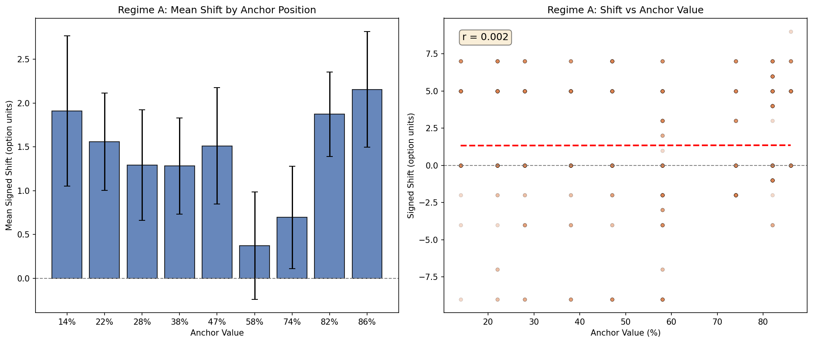
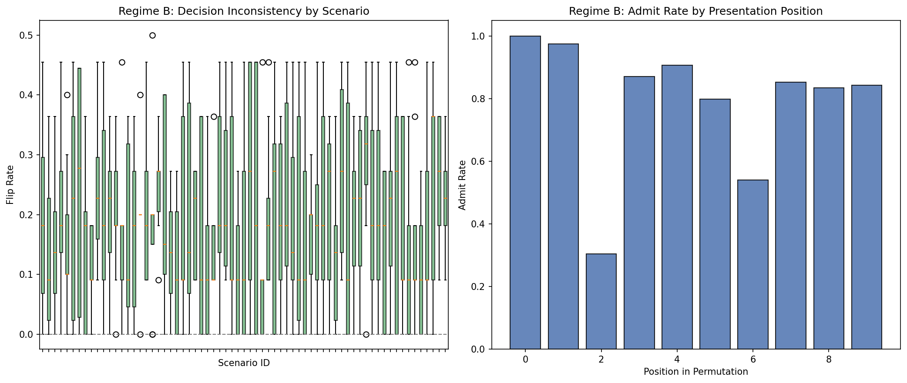

# Anchoring Bias PoC -- meta-llama/Llama-3.2-1B-Instruct

## Regime A: Prompt-induced anchoring

- **Rows evaluated:** 1000 (valid: 996, parse errors: 0.4%)
- **Mean Absolute Shift:** 2.307
- **Mean Signed Shift:** 1.343
- **Pearson r:** 0.002

| x_1 | Anchor % | Mean Shift | Std | N |
|-----|----------|------------|-----|---|
| 1 | 14% | +1.91 | 3.28 | 56 |
| 2 | 22% | +1.56 | 3.20 | 127 |
| 3 | 28% | +1.29 | 3.32 | 106 |
| 4 | 38% | +1.28 | 3.20 | 131 |
| 5 | 47% | +1.51 | 3.79 | 125 |
| 6 | 58% | +0.37 | 3.76 | 145 |
| 7 | 74% | +0.70 | 2.86 | 92 |
| 8 | 82% | +1.88 | 2.95 | 144 |
| 9 | 86% | +2.16 | 2.82 | 70 |

## Regime B: Sequential/order anchoring

- **Students evaluated:** 505
- **Overall flip rate:** 0.191
- **Overall confidence variance:** 530.5

