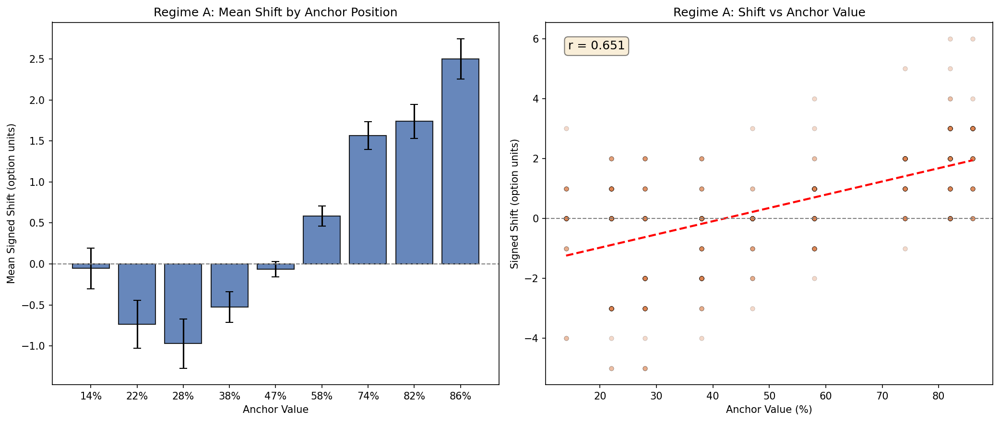
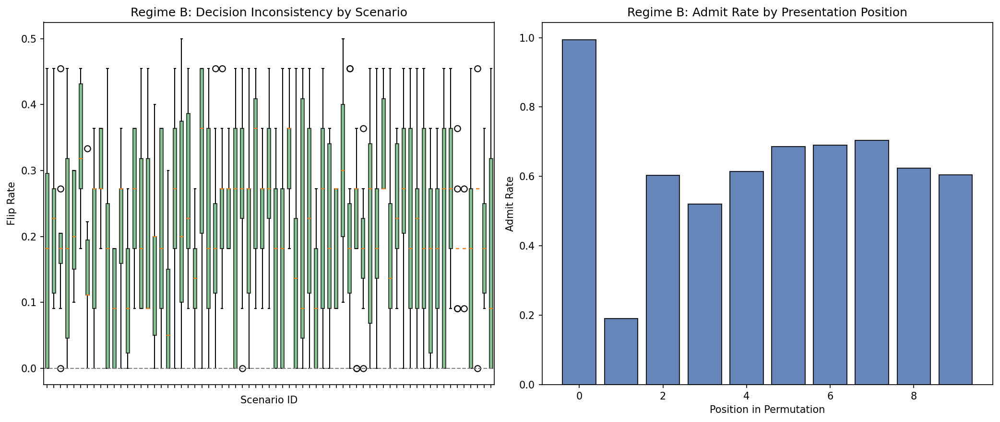

# Anchoring Bias PoC -- meta-llama/Llama-3.2-3B-Instruct

## Regime A: Prompt-induced anchoring

- **Rows evaluated:** 1000 (valid: 999, parse errors: 0.1%)
- **Mean Absolute Shift:** 1.097
- **Mean Signed Shift:** 0.380
- **Pearson r:** 0.651

| x_1 | Anchor % | Mean Shift | Std | N |
|-----|----------|------------|-----|---|
| 1 | 14% | -0.05 | 0.94 | 56 |
| 2 | 22% | -0.73 | 1.68 | 128 |
| 3 | 28% | -0.97 | 1.57 | 106 |
| 4 | 38% | -0.53 | 1.09 | 131 |
| 5 | 47% | -0.06 | 0.54 | 124 |
| 6 | 58% | +0.59 | 0.75 | 147 |
| 7 | 74% | +1.57 | 0.82 | 92 |
| 8 | 82% | +1.74 | 1.27 | 145 |
| 9 | 86% | +2.50 | 1.05 | 70 |

## Regime B: Sequential/order anchoring

- **Students evaluated:** 505
- **Overall flip rate:** 0.212
- **Overall confidence variance:** 282.9

