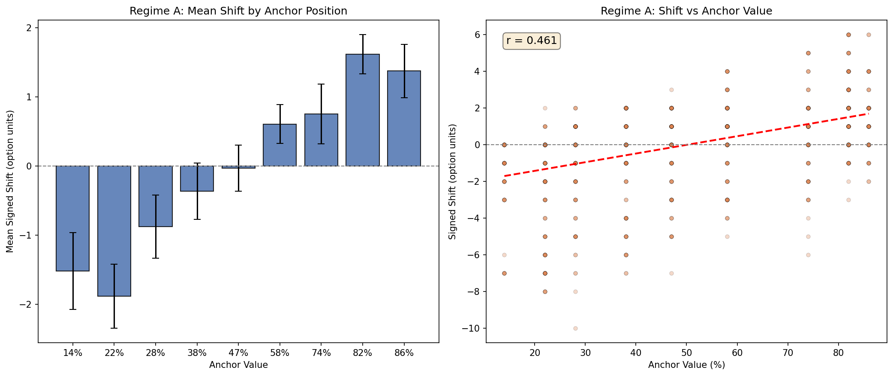
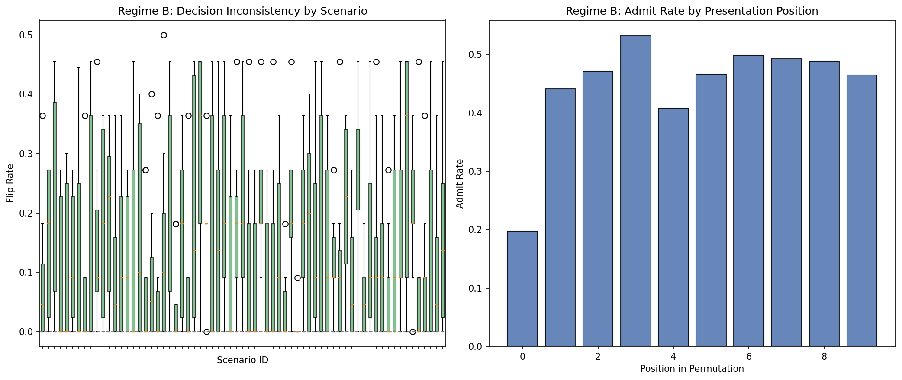

# Anchoring Bias PoC -- Qwen/Qwen3-4B-Instruct-2507

## Regime A: Prompt-induced anchoring

- **Rows evaluated:** 1000 (valid: 1000, parse errors: 0.0%)
- **Mean Absolute Shift:** 1.655
- **Mean Signed Shift:** 0.017
- **Pearson r:** 0.461

| x_1 | Anchor % | Mean Shift | Std | N |
|-----|----------|------------|-----|---|
| 1 | 14% | -1.52 | 2.11 | 56 |
| 2 | 22% | -1.88 | 2.66 | 128 |
| 3 | 28% | -0.88 | 2.41 | 106 |
| 4 | 38% | -0.37 | 2.37 | 131 |
| 5 | 47% | -0.03 | 1.91 | 125 |
| 6 | 58% | +0.61 | 1.73 | 147 |
| 7 | 74% | +0.75 | 2.11 | 92 |
| 8 | 82% | +1.61 | 1.75 | 145 |
| 9 | 86% | +1.37 | 1.65 | 70 |

## Regime B: Sequential/order anchoring

- **Students evaluated:** 505
- **Overall flip rate:** 0.146
- **Overall confidence variance:** 171.7

