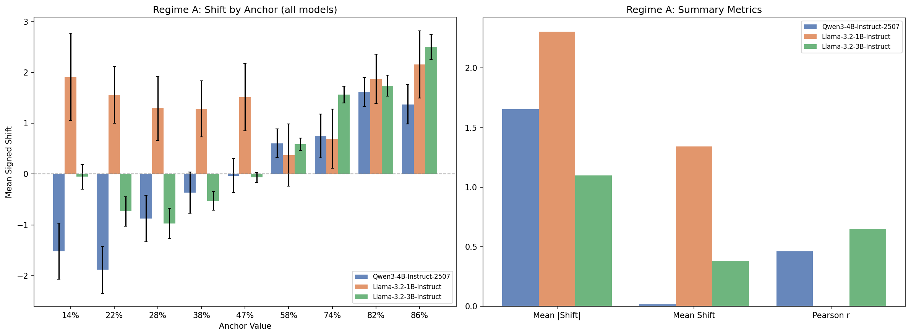
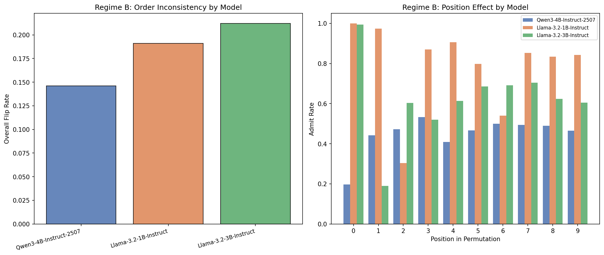

# Anchoring Bias in LLMs -- Multi-Model Comparison Report

**Models:** `Qwen3-4B-Instruct-2507`, `Llama-3.2-1B-Instruct`, `Llama-3.2-3B-Instruct`

## 1. Objective

This report compares anchoring bias across multiple LLMs in two regimes:

- **Regime A (prompt-induced):** control vs treatment prompts from tum-nlp/cognitive-biases-in-llms.

- **Regime B (order-induced):** permuted student profiles from jecht/cognitive_bias.

## 2. Regime A Comparison

| Model | N Valid | Parse Err % | Mean |Shift| | Mean Shift | Pearson r |
|-------|--------|-------------|-------------|------------|-----------|
| Qwen3-4B-Instruct-2507 | 1000 | 0.0% | 1.655 | 0.017 | 0.461 |
| Llama-3.2-1B-Instruct | 996 | 0.4% | 2.307 | 1.343 | 0.002 |
| Llama-3.2-3B-Instruct | 999 | 0.1% | 1.097 | 0.380 | 0.651 |

## 3. Regime B Comparison

| Model | N Students | Flip Rate | Conf Variance |
|-------|-----------|-----------|---------------|
| Qwen3-4B-Instruct-2507 | 505 | 0.146 | 171.7 |
| Llama-3.2-1B-Instruct | 505 | 0.191 | 530.5 |
| Llama-3.2-3B-Instruct | 505 | 0.212 | 282.9 |

## 4. Key Findings

- **Most anchored (Regime A):** `Llama-3.2-1B-Instruct` (mean |shift| = 2.307)
- **Least anchored (Regime A):** `Llama-3.2-3B-Instruct` (mean |shift| = 1.097)
- **Most order-sensitive (Regime B):** `Llama-3.2-3B-Instruct` (flip rate = 0.212)
- **Least order-sensitive (Regime B):** `Qwen3-4B-Instruct-2507` (flip rate = 0.146)

## 5. Limitations

- **Temperature = 0:** Deterministic decoding eliminates stochastic variation but may mask anchoring that surfaces with sampling.
- **Parse-error rate:** Structured output parsing may miss edge cases, especially for smaller models.
- **Anchor mapping:** The `x_1` -> anchor percentage mapping was empirically determined from treatment text.
- **Model size range:** Comparing 1B--4B models; larger models may show different anchoring patterns.
