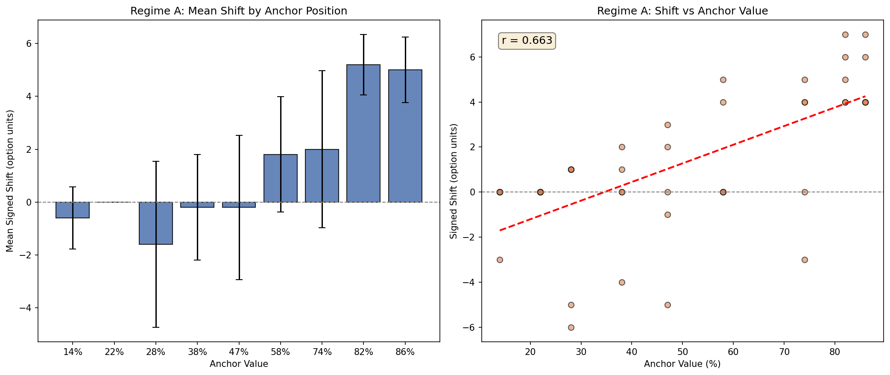
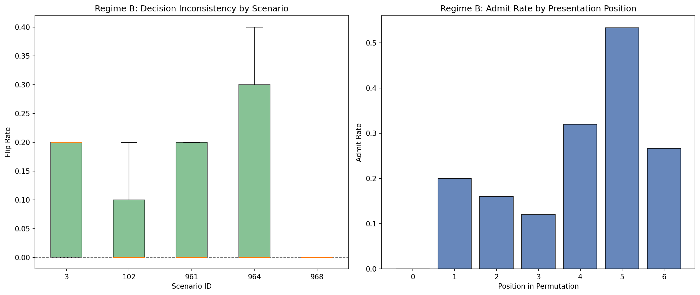

# Anchoring Bias in LLMs -- PoC Report

**Model:** `Qwen/Qwen2.5-7B-Instruct`

## 1. Objective

This PoC measures **anchoring** as an invariance failure in LLM decision-making. A model free of anchoring bias should produce the same answer regardless of (a) irrelevant numeric cues embedded in the prompt and (b) the presentation order of items. We test two complementary regimes:

- **Regime A (prompt-induced):** control vs treatment prompts from tum-nlp, where the treatment injects a numeric anchor.
- **Regime B (order-induced):** the same set of student profiles presented in different permutations from jecht/cognitive_bias.

## 2. Data Mapping Assumptions

### tum-nlp/cognitive-biases-in-llms

| Role | Field | Notes |
|------|-------|-------|
| Bias label | `bias` | Filtered to `"Anchoring"` (1000 rows) |
| Control prompt | `control` | Self-contained, Options 1-11 (0%-100%) |
| Treatment prompt | `treatment` | Adds anchor cue ("more than X%?") |
| Metadata | `metric_params` | String -> dict via `ast.literal_eval` |
| Anchor position | `x_1` | Integer 1-9, only varying key for Anchoring |
| Constant keys | `k=1`, `flip_treatment=False` | No stratification value |

### jecht/cognitive_bias (anchoring/students.csv)

| Role | Field | Notes |
|------|-------|-------|
| Student profile | `prompts` | Free-text with GPA, GRE, etc. |
| Scenario group | `id` | 67 groups of 5-10 students |
| Permutations | row ordering | Pre-built blocks within each id |

## 3. Regime A Results

- **Rows evaluated:** 45 (valid: 45, parse errors: 0.0%)
- **Mean Absolute Shift (ASS):** 2.467 option units
- **Mean Signed Shift:** 1.267 option units
- **Pearson r (anchor % vs shift):** 0.663

### Per-bin breakdown

| x_1 | Anchor % | Mean Shift | Std | N |
|-----|----------|------------|-----|---|
| 1 | 14% | -0.60 | 1.34 | 5 |
| 2 | 22% | +0.00 | 0.00 | 5 |
| 3 | 28% | -1.60 | 3.58 | 5 |
| 4 | 38% | -0.20 | 2.28 | 5 |
| 5 | 47% | -0.20 | 3.11 | 5 |
| 6 | 58% | +1.80 | 2.49 | 5 |
| 7 | 74% | +2.00 | 3.39 | 5 |
| 8 | 82% | +5.20 | 1.30 | 5 |
| 9 | 86% | +5.00 | 1.41 | 5 |

## 4. Regime B Results

- **Students evaluated:** 31
- **Overall flip rate:** 0.084
- **Overall confidence variance:** 314.5

### Per-scenario summary

| Scenario | Mean Flip Rate | Mean Conf Var |
|----------|---------------|---------------|
| 3 | 0.114 | 373.2 |
| 102 | 0.057 | 177.1 |
| 961 | 0.080 | 465.5 |
| 964 | 0.143 | 396.8 |
| 968 | 0.000 | 158.5 |

### Position effect

| Position | Admit Rate | Mean Confidence | N |
|----------|-----------|-----------------|---|
| 0 | 0.000 | 42.0 | 25 |
| 1 | 0.200 | 33.6 | 25 |
| 2 | 0.160 | 27.6 | 25 |
| 3 | 0.120 | 24.4 | 25 |
| 4 | 0.320 | 38.6 | 25 |
| 5 | 0.533 | 48.3 | 15 |
| 6 | 0.267 | 37.3 | 15 |

## 5. Limitations

- **Subsample size:** PoC uses a small stratified sample; full dataset evaluation would yield more robust statistics.
- **Single model:** Results are model-specific; generalization requires multi-model comparison.
- **Temperature = 0:** Deterministic decoding eliminates stochastic variation but may mask anchoring that surfaces with sampling.
- **Parse-error rate:** Structured output parsing may miss edge cases in model responses.
- **Anchor mapping:** The `x_1` -> anchor percentage mapping was empirically determined from treatment text; it may have rounding artifacts.
